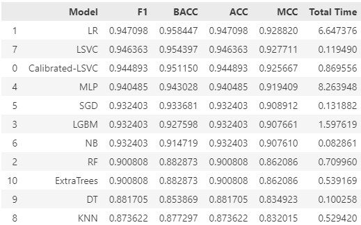
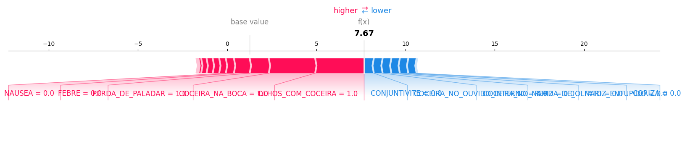
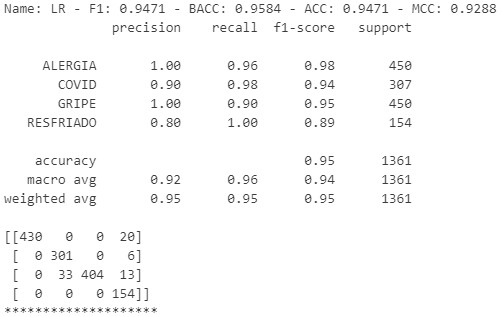
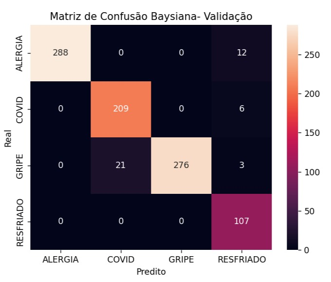
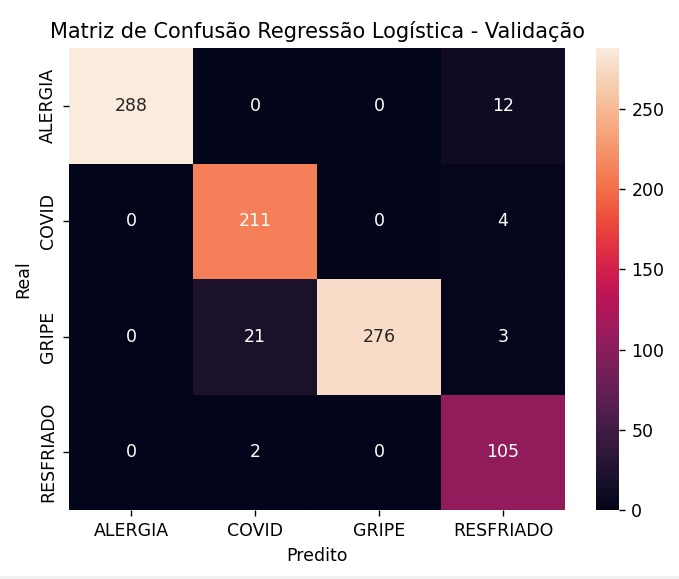
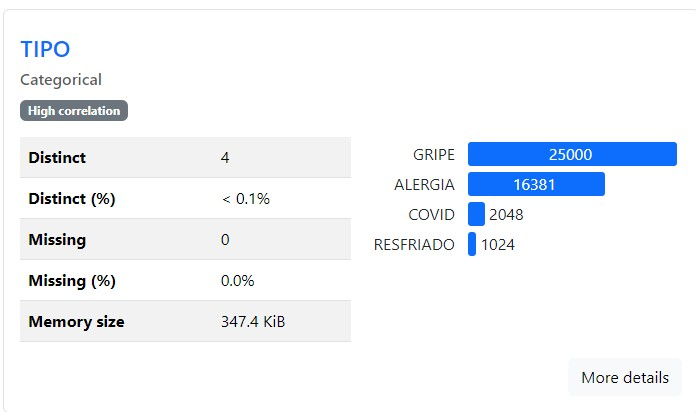
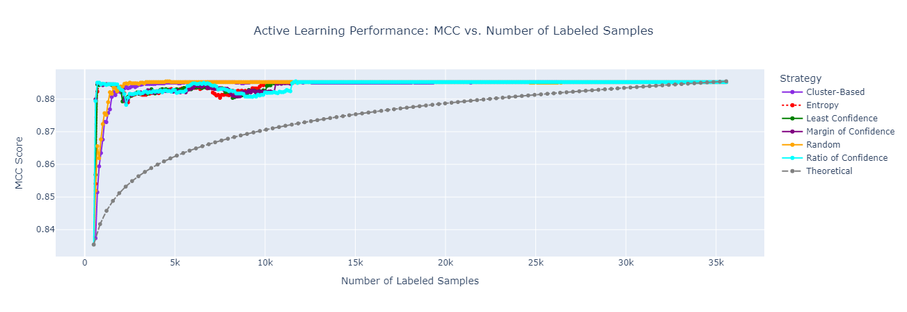

# 🤖 Chatbot Médico Inteligente 🩺

Um agente de IA projetado para auxiliar na triagem e no fornecimento de informações sobre doenças respiratórias comuns (Gripe, Resfriado Comum, Alergias e COVID-19), utilizando uma base de conhecimento confiável e modelos preditivos explicáveis.

> **Objetivo do Projeto:** Oferecer uma primeira camada de orientação de diagnóstico baseada em inferência e probabilidade.

## ✨ Principais Funcionalidades

* **Triagem Inteligente de Sintomas:** Utiliza um modelo de Machine Learning para analisar os sintomas relatados pelo usuário e calcular a probabilidade de cada uma das quatro condições respiratórias.
> **Modelos Machine Learning:** Pipeline como modelos clássicos de Machine Learning, os selecionados para inferência foram a Regressão Logística e a Rede Bayesiana.
* **Base de Conhecimento Confiável (RAG):** Responde a perguntas sobre as doenças, tratamentos e prevenção utilizando a técnica de *Retrieval-Augmented Generation* (RAG) sobre documentos oficiais e guias de saúde. 
> **Modelo Embedding:** Foi utilizado o Snowflake-Artic-Embed2, disponível no Ollama ou no Hugging Face.
* **Análise Preditiva Explicável (XAI):** Para cada predição, gera um gráfico de forças (force plot) utilizando a biblioteca `SHAP`, mostrando quais sintomas mais contribuíram para o diagnóstico sugerido e por quê.
> **LLM-Gemini-1.5-Flash:** Escolhemos o modelo do Gemini devido a alinhamento com os objetivos do projeto, gratuitidade para o nosso uso e experiência prévia com o modelo.


## 📚 Base de Conhecimento e Fontes de Dados

A confiabilidade do sistema é garantida por fontes de dados oficiais e datasets públicos reconhecidos.

### 1. Base de Conhecimento para RAG

Os documentos a seguir foram vetorizados e armazenados no `ChromaDB` para alimentar o sistema de respostas:

* **Gripe (Influenza):**
    * Guia de Manejo e Tratamento de Influenza 2023 - Ministério da Saúde.
    * Visão Geral e Manejo de Resfriados e Gripe - Universidade de Limpopo.
    * Influenza (Sazonal) - Organização Mundial da Saúde (OMS).
* **Resfriado Comum:**
    * Guia do Episódio de Cuidado: Resfriado comum - Hospital Albert Einstein.
    * Resfriado Comum - Johns Hopkins Medicine.
* **Alergias Respiratórias:**
    * Guia Rápido para Alergias Respiratórias - Allergy UK.
    * Guia Definitivo para Identificar Alergias Respiratórias - ARCpoint Labs.
    * Livro da EFA sobre Alergias Respiratórias - European Federation of Allergy and Airways Diseases Patients' Associations.
* **COVID-19:**
    * Doença do Coronavírus (COVID-19) - Organização Mundial da Saúde (OMS).
* **Diretrizes Gerais de Sinais e Sintomas:**
    * Guia de Prática Clínica: Sinais e Sintomas Respiratórios - Conselho Federal de Farmácia.

### 2. Dataset para Análise Preditiva

Para o treinamento e avaliação dos modelos de classificação, foi utilizado um dataset público que contém uma lista de sintomas associados às quatro doenças.

* **Sintomas de Gripe, Resfriado, Alergia e COVID-19:**
    * **Fonte:** Kaggle
    * **Link:** [COVID, Flu, Cold, Allergy Symptoms Dataset](https://www.kaggle.com/datasets/walterconway/covid-flu-cold-symptoms)

## 🫛 PEAS (Perfomance, Enviroments, Actuators, Sensors)

1.  **Perfomance:** 
    * **Métricas no conjunto de validação.**

    

2.  **Enviroment:**
    * **LLM:** Gemini 1.5 Flash
    * **Base de Conhecimento:** Todos os mencionados anteriormente.
3. **Actuators:** 
    * **Resposta do chatbot**
    * **Inferência do Modelo**
    * **Busca de Informações com o RAG**
4. **Sensores**
    * **Interpretabilidade do texto do Usuário**
    * **Parser do Pydantic**
    * **Embeddings para o RAG**

## ⚙️ Como Funciona - Arquitetura

O fluxo de interação do sistema ocorre da seguinte forma:

1.  **Entrada do Usuário:** O usuário descreve seus sintomas em linguagem natural.
2.  **Extração de Sintomas:** Uma LLM (Large Language Model) processa o texto e preenche uma estrutura de dados (Pydantic), identificando a presença ou ausência de sintomas pré-definidos (ex: febre, tosse, coriza).
3.  **Classificação Preditiva:** O vetor de sintomas estruturado é enviado para um modelo de classificação (ex: Regressão Logística) treinado, que retorna a probabilidade de cada doença.
4.  **Geração de Explicação:** O `SHAP Explainer` analisa a predição e gera um *force plot*, que é salvo como uma imagem. 
5.  **Resposta ao Usuário:** O sistema apresenta a doença mais provável com seu percentual de confiança e permite que o usuário faça perguntas abertas, que são respondidas pelo sistema RAG.

## 📏 Métricas

Como o nosso conjunto é desbalanceado, optamos pela métricas do F1-score, BACC , ACC e MCC.
Selecionamos o modelo com maior MCC para fazer a inferência dos sintomas enviados pelos usuários.
1. **Resultado Métricas para a Pipeline**
    * **Validação:** Demonstrada no tópico do PEAS. 
    * **Teste:** A partir do resultado no conjunto de validação escolhemos o melhor modelo como a Regressão Logística. E os resultados das métricas no conjunto de teste foi:

        .

2. **Matriz de Confusão**

Para o modelo Bayesiano:



Para a Regressão Logística:



## 🆘 Limitações e Dificuldades na Construção do Projeto:
* **Base de Conhecimento:** Dificuldade em encontrar informações confiáveis, principalmente para o COVID, que foi sujeito a uma grande quantidade de desinformação e fake news durante a pandemia.
* **Dados Desbalanceados:** Os dados do nosso conjunto são muito desbalanceados:



Por isso utilizamos o active learning para identificar a melhor estratégia de seleção da amostra:


Observamos ao analisar o gráfio do MCC que devido a facilidade da nossa tarefa de classificação poderíamos utilizar a amostra aleatória sem perdas de qualidade.

No final optamos por selecionar de forma aleatória 3000 instâncias para gripe e alrgia e manter todas as instâncias das outras duas classes.
* **SHAP:** Tivemos dificuldade para plotar o XAI para o modelo Bayesiano;

## 🔮 Possíveis Melhorias
* Corrigir o SHAP para as redes Bayesianas com o intuitode garantir as explicabilidade desse modelo.
* Melhoria da experiência do usuário, ao aumentar a portabilidade do Chatbot ao adiciona-lo em aplicativos de comunicação como Whatsapp, Telegram, Discord.
* Criação de serviço que se comunique com o médico, com a finalidade de enviar o resumo da conversa, o resultado da inferência e sua confiança, além da imagem do SHAP, explicando o resultado.

## 🚀 Tecnologias Utilizadas

| Categoria                               | Tecnologias                                     |
| :-------------------------------------- | :---------------------------------------------- |
| **Machine Learning & Análise Preditiva**| `scikit-learn`, `pandas`, `numpy`      |
| **RAG & LLMs** | `LangChain`, `ChromaDB`, `Gemini` |
| **Explicabilidade de IA (XAI)** | `SHAP`                                          |
| **Estrutura de Dados & Tipagem** | `Pydantic`                                      |
| **Visualização de Dados** | `Matplotlib`                                    |
## 🛠️ Como Executar o Projeto

1.  **Clone o Repositório**
    ```bash
    git clone [https://github.com/seu-usuario/chatbot-medico.git](https://github.com/seu-usuario/chatbot-medico.git)
    cd chatbot-medico
    ```

2.  **Crie e Ative um Ambiente Virtual**
    ```bash
    python -m venv .venv
    source .venv/bin/activate  # No Windows: .venv\Scripts\activate
    ```

3.  **Instale as Dependências**
    ```bash
    pip install -r requirements.txt
    ```

4.  **Configure as Variáveis de Ambiente**
    * Crie um arquivo `.env` na raiz do projeto e adicione sua chave de API para o modelo de linguagem (ex: Google Gemini).
    ```env
    GOOGLE_API_KEY="SUA_CHAVE_DE_API_AQUI"
    ```

5.  **Execute o Sistema**
    * Utilize os notebooks na pasta para interagir com as funções ou execute o script principal da sua aplicação.
    * Para utilizar o chatbot utilize o App do streamlit. 
        ```bash
        streamlit run app.py
        ```
